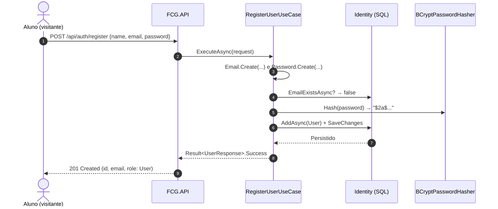
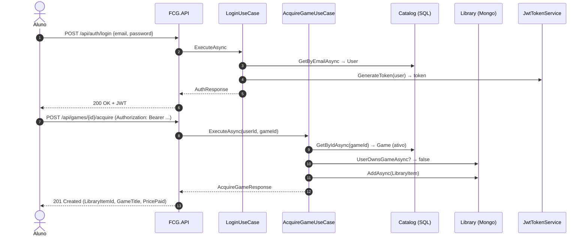
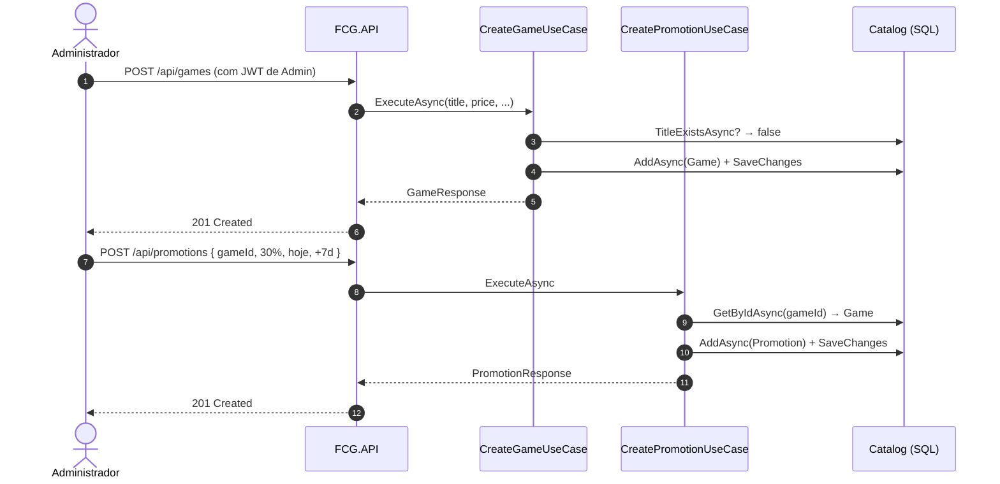

# Domain Storytelling — FCG

Domain Storytelling captura cenários reais de uso da plataforma na linguagem de negócio. Cada história representa uma interação ponta-a-ponta entre **atores**, **ações** e **objetos do domínio**.

---

## História 1 — *"O aluno cria sua conta na FCG"*



**Pano de fundo:** o aluno entra no portal pela primeira vez, fornece nome, e-mail acadêmico e uma senha forte. O sistema valida, garante que o e-mail é único e cria a conta com role *User*.

---

## História 2 — *"O aluno faz login e adquire seu primeiro jogo"*



**Pano de fundo:** após autenticar, o aluno escolhe um jogo do catálogo e finaliza a aquisição. O sistema impede aquisições duplicadas pelo índice único `(UserId, GameId)` no MongoDB.

---

## História 3 — *"O administrador cadastra um jogo e cria uma promoção de lançamento"*



**Pano de fundo:** apenas usuários com `Role=Admin` conseguem chegar nestes endpoints (forçado por `[Authorize(Roles=Admin)]`). O preço corrente do jogo passa a refletir automaticamente o desconto durante a vigência da promoção.

---

## História 4 — *"O aluno quer ver promoções e filtrar jogos por gênero"*

O aluno abre a vitrine, observa as promoções ativas e filtra apenas RPGs com preço inferior a R$ 100. Para a vitrine REST simples ele consome `GET /api/promotions`. Para uma vitrine mais sofisticada, o frontend usa GraphQL:

```graphql
query {
  games(
    where: {
      genre: { eq: "RPG" }
      price: { lte: 100 }
      isActive: { eq: true }
    }
    order: [{ price: ASC }]
  ) {
    id
    title
    price
    releaseDate
  }
}
```

GraphQL (HotChocolate) é exposto em `POST /graphql` e Banana Cake Pop fica em `GET /graphql/`. Filtros, ordenações e projeções são gerados automaticamente em cima do `IQueryable<Game>` exposto pelo repositório.
