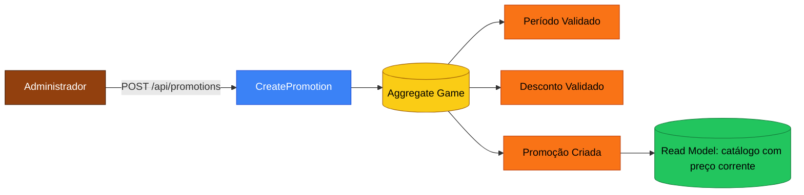
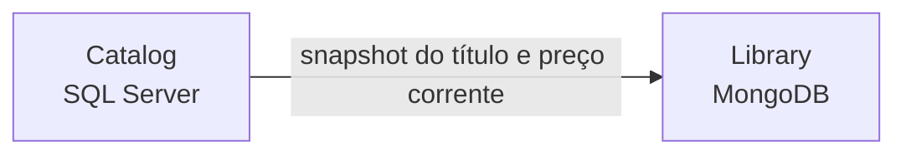

# Event Storming — Fluxo de Jogos (Catalog & Library)

## Fluxo: Cadastro de um jogo no catálogo

```mermaid
flowchart LR
    classDef cmd fill:#3b82f6,color:#fff,stroke:#1d4ed8;
    classDef evt fill:#f97316,color:#000,stroke:#c2410c;
    classDef agg fill:#facc15,color:#000,stroke:#a16207;
    classDef pol fill:#a855f7,color:#fff,stroke:#6b21a8;
    classDef rm  fill:#22c55e,color:#000,stroke:#15803d;
    classDef act fill:#92400e,color:#fff,stroke:#451a03;

    A[Administrador]:::act -->|POST /api/games| C[CreateGame]:::cmd
    C --> AGG[(Aggregate Game)]:::agg
    AGG --> E1[Título Validado]:::evt
    AGG --> E2[Preço Validado]:::evt
    AGG --> E3[Jogo Cadastrado]:::evt
    E3 --> RM[(Read Model: catálogo público)]:::rm
    E3 --> POL{Política: notificar usuários (futuro)}:::pol
```

### Comandos
- `CreateGame(title, description, genre, price, releaseDate)` — exclusivo de Admin.

### Eventos
- `GameCreated { GameId, Title, Genre, Price, At }`

### Invariantes
- Título é único e tem >= 2 caracteres.
- Preço >= 0.
- Gênero obrigatório.

### Hot spots
- 🟥 *Soft delete vs hard delete?* — **decidido**: soft delete (`Deactivate`) preserva histórico de aquisições.

---

## Fluxo: Criação de promoção



### Invariantes
- Desconto > 0 e <= 90.
- `EndsAt` posterior a `StartsAt`.
- O método `Game.GetCurrentPrice` aplica o **maior** desconto entre as promoções vigentes.

---

## Fluxo: Aquisição de um jogo (Catalog → Library)

```mermaid
flowchart LR
    classDef cmd fill:#3b82f6,color:#fff,stroke:#1d4ed8;
    classDef evt fill:#f97316,color:#000,stroke:#c2410c;
    classDef agg fill:#facc15,color:#000,stroke:#a16207;
    classDef pol fill:#a855f7,color:#fff,stroke:#6b21a8;
    classDef rm  fill:#22c55e,color:#000,stroke:#15803d;
    classDef act fill:#92400e,color:#fff,stroke:#451a03;

    A[Usuário Autenticado]:::act -->|POST /api/games/:id/acquire| C[AcquireGame]:::cmd
    C --> AGG1[(Aggregate Game)]:::agg
    AGG1 --> E1[Preço Corrente Calculado]:::evt
    C --> AGG2[(Aggregate LibraryItem)]:::agg
    AGG2 --> E2[Aquisição Validada]:::evt
    AGG2 --> E3[Jogo Adquirido]:::evt
    E3 --> RM[(Read Model: minha biblioteca)]:::rm
    E3 --> POL{Política: notificar receita / rankings (futuro)}:::pol
```

### Comandos
- `AcquireGame(userId, gameId)` — usuário autenticado.

### Eventos
- `GameAcquired { LibraryItemId, UserId, GameId, PricePaid, At }`

### Invariantes
- Jogo precisa estar ativo.
- Usuário **não pode** já possuir o jogo (índice único Mongo `(UserId, GameId)`).
- `PricePaid` é o preço corrente no momento da aquisição (snapshot — promoções futuras não alteram preços já pagos).

### Hot spots
- 🟥 *Pagamento real (gateway)?* — **fora do escopo da Fase 1** (MVP).
- 🟥 *Reembolso?* — postergado para fases futuras.

---

## Mapa de contexto entre Catalog e Library



A Fase 1 grava `gameTitle` e `pricePaid` denormalizados em `LibraryItem`. Isso assume "snapshot" do estado do jogo no momento da compra e desacopla a leitura da biblioteca da disponibilidade do catálogo (mesmo se o jogo for desativado, a biblioteca continua íntegra).
