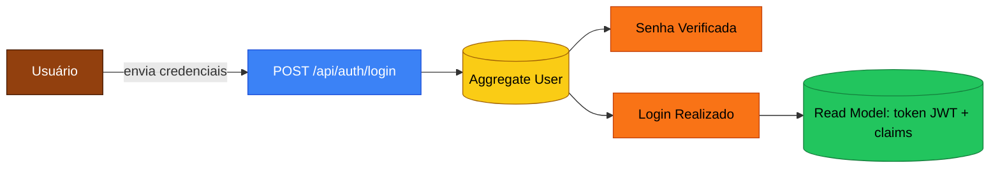
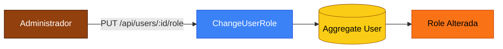
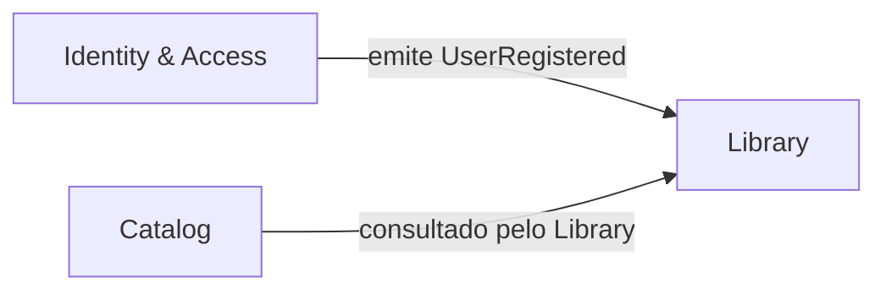

# Event Storming — Fluxo de Usuários (Identity & Access)

## Legenda (paleta clássica do Event Storming)

| Cor | Conceito |
|----|----|
| 🟧 Laranja | **Domain Event** (algo que aconteceu — passado) |
| 🟦 Azul | **Command** (intenção / ação) |
| 🟨 Amarelo | **Aggregate** (raiz que protege as invariantes) |
| 🟪 Roxo | **Policy / Process** (reage a um evento e dispara outro) |
| 🟥 Vermelho | **Hot Spot** (problema, dúvida, risco) |
| 🟩 Verde | **Read Model** (visão de leitura para a UI) |
| 🟫 Marrom | **Actor** (quem inicia a ação) |

## Fluxo: Criação de usuário (cadastro público)

```mermaid
flowchart LR
    classDef cmd fill:#3b82f6,color:#fff,stroke:#1d4ed8;
    classDef evt fill:#f97316,color:#000,stroke:#c2410c;
    classDef agg fill:#facc15,color:#000,stroke:#a16207;
    classDef pol fill:#a855f7,color:#fff,stroke:#6b21a8;
    classDef rm  fill:#22c55e,color:#000,stroke:#15803d;
    classDef act fill:#92400e,color:#fff,stroke:#451a03;

    A[Visitante]:::act -->|inicia| C1[POST /api/auth/register]:::cmd
    C1 --> AGG[(Aggregate User)]:::agg
    AGG -->|valida e-mail e senha forte| E1[E-mail Validado]:::evt
    AGG -->|verifica unicidade| E2[E-mail Único Confirmado]:::evt
    AGG -->|gera hash BCrypt da senha| E3[Senha Hashed]:::evt
    AGG --> E4[Usuário Cadastrado]:::evt
    E4 --> RM1[(Read Model: lista de usuários)]:::rm
    E4 --> P1{Política: enviar e-mail de boas-vindas (futuro)}:::pol
```

### Comandos
- `RegisterUser(name, email, password)` — emitido pelo visitante.

### Eventos de domínio
- `EmailValidated`
- `EmailUniquenessConfirmed`
- `PasswordHashed`
- `UserRegistered { UserId, Email, Role=User, At }`

### Invariantes
- E-mail respeita regex e é único.
- Senha tem no mínimo 8 caracteres, com letra, número e caractere especial.
- Role inicial sempre é `User`.

### Hot spots / decisões
- 🟥 *E-mail será confirmado por link?* — **Postergado para Fase 2**.
- 🟥 *Política de bloqueio após N tentativas?* — **Postergado para Fase 2** (compõe com observabilidade).

---

## Fluxo: Login



### Comandos
- `Login(email, password)`

### Eventos
- `PasswordVerified`
- `UserLoggedIn { UserId, At, ExpiresAt }`

### Invariantes
- Falha em verificar senha e e-mail produz a mesma resposta (`Credenciais inválidas`) — evita *user enumeration*.

---

## Fluxo: Promoção de usuário a Administrador



### Invariantes
- Apenas usuários com `Role=Admin` podem executar (forçado por `[Authorize(Roles=Admin)]`).

---

## Mapa de contexto



A Fase 1 implementa esses contextos como módulos do mesmo monolito; eventos de domínio são, por ora, processados *in-process*.
